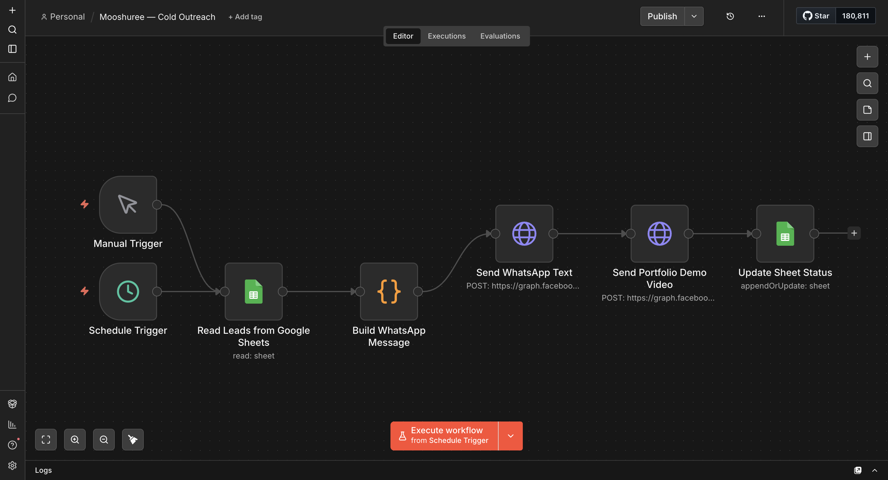
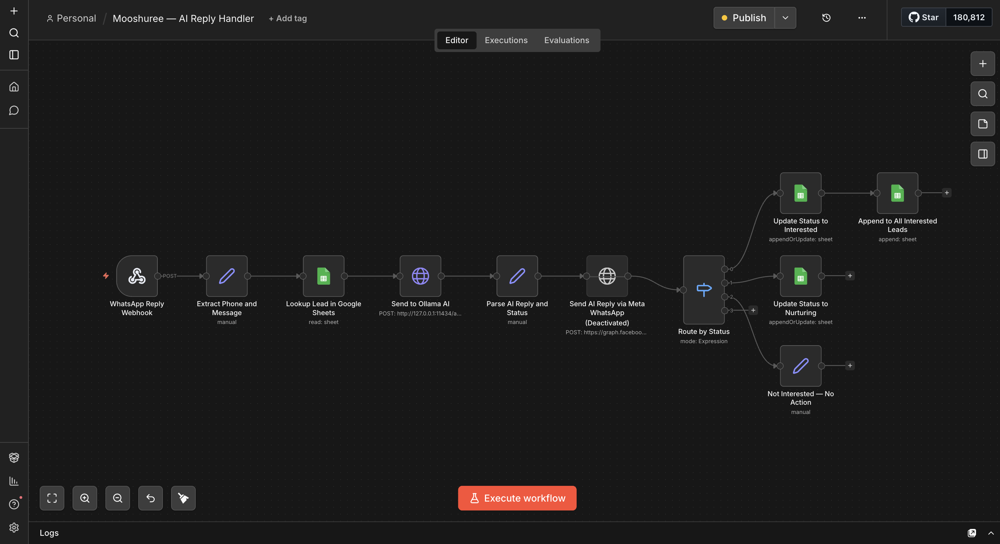

<div align="center">
  <h1>📱 n8n WhatsApp AI CRM</h1>
  <p><b>Free WhatsApp AI CRM using n8n + Ollama + Google Sheets for Indian SMBs. Zero cost.</b></p>

  <p>
    <a href="https://github.com/keviv777/n8n-whatsapp-ai-crm/stargazers"></a>
    <a href="https://github.com/keviv777/n8n-whatsapp-ai-crm/network/members"></a>
    
    
  </p>
</div>

---

## 🚀 What It Does

This project is a fully automated, **zero-cost Customer Relationship Management (CRM) system** designed specifically for Indian SMBs. 
It automates:
1. **WhatsApp Cold Outreach**: Sending initial outreach messages via the official Meta Cloud API.
2. **AI Reply Classification**: Connecting local/hosted LLMs via Ollama (`llama3`) to read, understand, and classify customer replies (e.g., Interested, Not Interested, Needs Follow-up).
3. **Google Sheets CRM**: Automatically updating the lead status and conversation history dynamically in a Google Sheet.

## 🏗️ Architecture

```text
           +-----------------+          +-----------------+
           | Meta WhatsApp   |          |                 |
Users <--->| Cloud API       |<-------->|      n8n        |
           | (Webhooks & Msg)|          | (Orchestration) |
           +-----------------+          +-----------------+
                                           |           |
                                           v           v
                                +------------+    +---------------+
                                |   Ollama   |    | Google Sheets |
                                | (Llama 3)  |    | (CRM Database)|
                                +------------+    +---------------+
```

## ✨ Features

- **Fully Automated Pipeline**: From reading leads on Google Sheets to sending intro messages over WhatsApp.
- **Smart AI Routing**: Intelligently classifies replies from leads to update their position in the sales funnel.
- **Zero API Cost for AI**: Leveraging `Ollama` and `Llama 3` for powerful AI processing without relying on expensive OpenAI API calls.
- **Simple Database Management**: Uses Google Sheets—easy for anyone to manage without database knowledge.
- **Webhook Integration**: Capable of ingesting real-time webhook data from Meta.

## 🛠️ Tech Stack

- **[n8n](https://n8n.io/)**: Open-source workflow automation.
- **[Ollama](https://ollama.com/) (`Llama 3`)**: Run LLMs locally.
- **[Meta WhatsApp Cloud API](https://developers.facebook.com/docs/whatsapp/cloud-api/)**: Official platform for bulk/business messaging.
- **[Google Sheets API](https://developers.google.com/sheets/api)**: Simple, universally accessible CRM storage.

## ⚙️ Setup Instructions

To get this CRM running on your machine/server, follow these 5 simple steps:

1. **Clone & Prepare**: Clone this repository securely and review the setup documentation in the `docs/` folder.
2. **Setup Google Sheets**: Create a Google Cloud Console App, enable the Google Sheets API, download your service account JSON credentials, and create a lead tracking sheet.
3. **Import Workflows**: Open your local or cloud `n8n` instance and import the workflow JSON files located in the `workflows/` directory.
4. **Configure Credentials**: Fill in your Meta WhatsApp Cloud API credentials, Google Sheets Service Account, and Ollama Host URL within n8n's credential manager.
5. **Connect Webhooks**: Copy the webhook URL from your active n8n workflow and paste it into your Meta App dashboard to start receiving live incoming messages.

*(See [docs/setup-guide.md](docs/setup-guide.md) for full detailed instructions)*

## 📸 Screenshots

### Cold Outreach Workflow


### AI Reply Handler


---

<div align="center">
  <b>Built by Vivek Kumar Prajapati</b><br>
  <i>Building real AI products, not just learning theory.</i>
</div>
